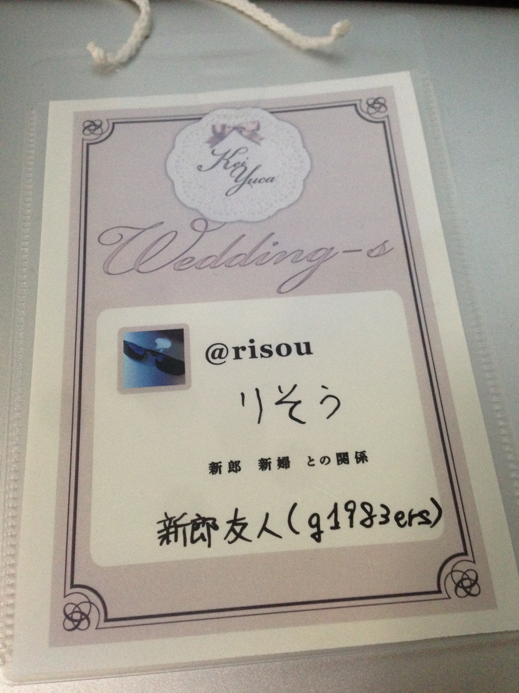

title: 友人の結婚を祝って秘密主義の僕がプライベートを（ちょっとだけ）晒してきた
date: 2013-10-22
datetime: 2013-10-22 23:07:32.440437 JST
alias: 12

---
2013年10月19日土曜日。

同い年の友人である [@kei_s](http://twitter.com/kei_s) さんの結婚パーティにお呼ばれしてきました。  

前後、他のイベントや余計な出来事がありましたが、ここではあまり触れません。

### 当日の服装

新郎から「勝負Tシャツなど自分がいちばんチャーミングに見える格好でいらしてください」と指定されていたこともあり、結構悩みました。  

イベントの幹事の一人である [@june29](http://twitter.com/june29) さんはタミヤTシャツだろうな、とか思いましたけど、

僕の勝負Tシャツとなると、前面に「私が神だ」と書かれたもらい物のTシャツになってしまうので、他の選択肢を模索し、

結局いつもどおりのグラサンスーツで挑むことにしました（グラサンとネクタイがチャーミングなポイントのつもりでした）。

### 会場入りまで

昼から夕方まで、Perl 入学式というイベントがあったため、五反田に行ってました。  

イベントの途中、空き時間を見つけて結婚パーティで使う資料をいじったり。

### 会場入り

開場時間に余裕を持って最寄り駅に移動。  

会場となるお店の位置を確認してから、いったん駅まで戻り、同行者と合流しました。

結局、開場まで少し時間がありましたが、受付の方に聞いてみたら入れてもらえたのでお店に入りました（外は雨が降ってたので助かりました）。  

入ると名札が用意されていて、アイコンや名前が印刷されていました。  

そこに「どう呼んでほしいか」「新郎新婦との関係」を書いてほしいと言われたので、普通に書きました。

 

名札。すごく手触りの良い紙だった。

### LT

このパーティには、おそらく深遠なる理由で LT があって、 LT で始まり LT で終わるという構成でした。

最初は新婦によるLT。「ウェディングドレスを着てLTしてみたかった」とのことで、参加者の関係をグラフにしたりクラスタリングしたり、とても面白いLTでした。  

なにより、このLTを見て、「あ、このパーティ居心地いいな」と思えました。  

そのせいか、『異常に嬉しそうにしていて、信じられないくらいに満足して帰っていった気がする』とか書かれました（[引用元](http://june29.jp/2013/10/21/happy-happy-wedding-s/)）。

その後、食事をいただいたり、友人たちと話をしたりして過ごして、残り1時間を切ったあたりで、公募枠、新婦招待枠、新郎招待枠のLTが始まりました。

僕も思うところがあってLTすることになっていたので、それっぽい資料を用意して挑みました。  

内容についてはプライベートなことで、普段なら「トップシークレットです」と返すような事柄ばかりだったので、

この場では公開することはできませんが、場を盛り上げる一助にはなったと思います。

他の皆様のLTもどれもすごくて、見ていて楽しめる幸せな時間でした。  

特に最後の [@darashi](http://twitter.com/darashi) さんのLTの最後、「これについて語るには LT は短すぎる」といわんばかりの時間稼ぎ（[参考](http://darashi.net/2013/10/22/wedding-s.html)）と、事情がわからず戸惑う新郎新婦、なんとなく事情を察してニヤニヤする参加者たちによって織り成される何ともいえない空気、上り詰めて落ちる直前のジェットコースターのようでとても良かったです。  

LT が予定通り時間切れになってからのサプライズは、新郎新婦にしっかり驚いてもらえていたのがすごく嬉しくて、良いサプライズするなー、と勉強になる流れでした。

その後、しばらくの歓談タイムを経て、最後に新郎のLT。  

自分の結婚を祝うパーティの LT のためにモンキーパッチ当てる人はなかなかいないと思う。  

それだけ注力されただけあって、最後にふさわしい、その場にいた皆が嬉しくなるような LT でした。

### その後

まあいろいろあって、飲むヨーグルトを延々と頼みまくったり、飲むヨーグルト相手にニヤニヤしてる姿をその日初めてあった方に見られたりしてるうちに終電を逃してしまいました。

帰路が同じということで、新郎新婦の乗るタクシーに同乗させていただき、家の近くの駅前まで送っていただきました（ありがとうございました！）。

最初から最後まで一人で勝手に楽しみすぎてた感じで、いつもと違う姿をお見せしてしまいましたが、誰にも迷惑かかってなかったらいいな。  

ご結婚された kei さん yuca さん、本当におめでとうございます。そして、このようなパーティに呼んでいただきありがとうございました。  

諸々行き届いたすばらしいパーティをセッティングしてくれた幹事の皆様、本当にありがとうございました。  

また、僕の LT にでてきたパンデミックの画像を見逃さず、ボードゲームの話を一緒にしてくれた皆様、ありがとうございました。  

いろんな方とお話できて、とても楽しかったです。

### おまけ・帰路のどうでも良い話

で、そのまま家に帰れれば平和に終わったのですが……。  

駅前で遭遇したのは大学時代の同期4人。  

深夜に何やら怪しげなムービーの撮影をしていました。  

全体的に酷い格好で近づき難い集団でしたが、まあ既知の仲なので撮影の様子を見守り、

最後一瞬だけ自分も映ったりしました。  

実は似たようなことをちょうど1年くらい前に某大学の敷地内でやっていて、

そのときのムービーは今年の初めにあるイベントで公開されていたので、

おそらく今回のムービーも来年の初めくらいにどこかのイベントで公開されるでしょう。
